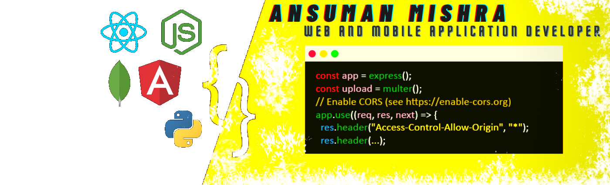

 

- 🔭 I’m currently working on [Google-Form-Automation](https://github.com/ansmis-lit/Google-Form-Automation).
- 👨‍💻 All of my projects are available at [https://ansmis-lit.github.io](https://ansmis-lit.github.io) will redirect you to [https://www.ansmis.tech/](https://www.ansmis.tech/).
- 💬 Ask me about **React Native, React.js, JavaScript, Node.js & Bootstrap**.
- 📫 How to reach me **ansmis.lit@gmail.com**.

                

&nbsp;

